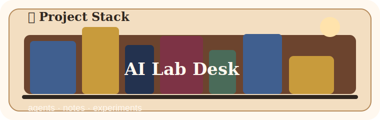
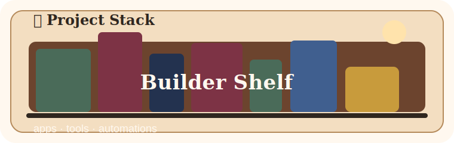

<h1 align="center">Silly Tool Valley Library Lobby</h1>

  <strong>Unity tooling, AI handbooks, editor utilities, and practical field notes.</strong> 
  A compact library-style profile for projects, books, and long-lived technical notes.

  <a href="#project-stacks">Project Stacks</a>
  &nbsp;/&nbsp;
  <a href="#e-book-shelf">E-Book Shelf</a>
  &nbsp;/&nbsp;
  <a href="https://sillytoolvalley.github.io/SillyToolValleyPage/">Open Catalog</a>
  &nbsp;/&nbsp;
  <a href="https://sillytoolvalley.github.io/SillyToolValleyPage/ebooks.html">E-Books</a>

  

---

## Library Map

<table>
<tr>
<td width="33%" align="center">
  <strong>Project Stacks</strong> 
  Tools, manuals, demos, and automation work.
</td>
<td width="33%" align="center">
  <strong>E-Book Shelf</strong> 
  Published handbooks with HTML, PDF, and page reader views.
</td>
<td width="33%" align="center">
  <strong>Catalog</strong> 
  A browsable public site for current releases and assets.
</td>
</tr>
</table>

---

## Project Stacks

<table>
<tr>
<td width="50%">
  
  <h3>OrPAD</h3>
  
Local-first editor workbench for Markdown, structured notes, diagrams, AI-assisted writing, and supervised orchestration workflows.

  
<code>Editor</code> <code>Markdown</code> <code>AI Workflow</code>

  
<a href="https://github.com/SillyToolValley/OrPAD">Open repository</a>

</td>
<td width="50%">
  
  <h3>Unity DOTS Manual</h3>
  
Manual and learning notes for Unity DOTS, Entities, Netcode for Entities, optimization, workflows, and migration patterns.

  
<code>Unity DOTS</code> <code>Entities</code> <code>Netcode</code>

  
<a href="https://github.com/SillyToolValley/Unity-DOTS-Manual">Open repository</a>

</td>
</tr>
</table>

---

## E-Book Shelf

<table>
<tr>
<td width="34%" align="center">
  
</td>
<td width="66%">
  <h3>A Shared Language for AI Practitioners</h3>
  
A practical multilingual handbook for discussing LLM systems, agents, RAG, safety, evaluation, and AI product workflows with clearer shared terms.

  
<code>LLM</code> <code>RAG</code> <code>Agents</code> <code>AI Security</code> <code>Workflow</code>

  

    <a href="https://sillytoolvalley.github.io/SillyToolValleyPage/handbook/en/ai-practitioner-handbook.html">HTML</a>
    &nbsp;/&nbsp;
    <a href="https://sillytoolvalley.github.io/SillyToolValleyPage/handbook/reader.html?lang=en">Page Reader</a>
    &nbsp;/&nbsp;
    <a href="https://sillytoolvalley.github.io/SillyToolValleyPage/handbook/en/ai-practitioner-handbook.pdf">PDF</a>
    &nbsp;/&nbsp;
    <a href="https://sillytoolvalley.github.io/SillyToolValleyPage/ebooks.html">Catalog Entry</a>
  

</td>
</tr>
</table>

---

## Publishing Notes

Public reading and citation are allowed. Automated scraping, dataset inclusion, AI training, and AI answer ingestion are not permitted without written permission.

  <a href="https://sillytoolvalley.github.io/SillyToolValleyPage/CRAWL_POLICY.md">Crawl policy</a>
  &nbsp;/&nbsp;
  <a href="https://sillytoolvalley.github.io/SillyToolValleyPage/robots.txt">robots.txt</a>

---

  Profile repository for <a href="https://github.com/SillyToolValley">SillyToolValley</a>.

